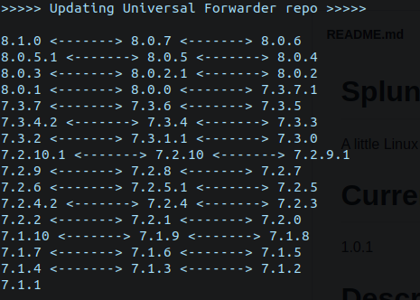
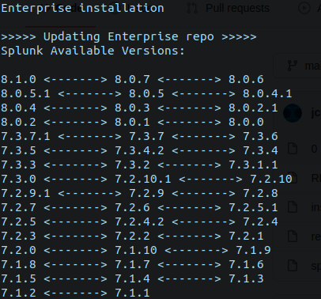

# Splunk_Install
A little Linux script to automate Splunk installation.

# Current Version

1.0.2

# Description

It provides an automated way of installing Splunk Universal Forwarders and Enteprise versions plus preparing some of the environment's work.

# How it works

Basically you just run it on your Linux Box. After that the funcionality breaks on the following steps:

1-Ask the user for the type of deployment that is required to be installed. Valid options are UF(universal forwarder) or ENT(enterprise)

2-Check if the there is a current Splunk deployment running and ask if remove it and proceed with a fresh installation or cancel. * If you want to proceed as an upgrade stop manually splunk before running this script.

3-Select Splunk Enterprise version or universal forwarder Linux versions pulled from 

--> https://www.splunk.com/en_us/download/previous-releases/universalforwarder.html
--> https://www.splunk.com/en_us/download/universal-forwarder.html

-->https://www.splunk.com/en_us/download/previous-releases.html
-->https://www.splunk.com/en_us/download/splunk-enterprise.html

This will create two files depending on the type of installation: uf_Repo.txt or enterprise_Repo.txt

4- It will adjust any user permissions on $SPLUNK_HOME if required.

5-Start Splunk (it will prompt for the admin user and password), *license will be accepted automatically.

6-Enable boot-start with the current user.

# notes

There is new funcionality that pulls versions and downloads links from the official splunk urls :)

It has been tested on ubuntu and CentOS. * On ubuntu run as bash splunkInstall.sh rather than sh splunkInstall.sh.

*Check that $user env variable is set accordingly.

*Make sure splunkInstall.sh and include.sh are both on the same directory.

*Splunk installation location is /opt/splunk, if prior to using this script you have Splunk on another location make sure to either delete or move it.

# Contribute

If you want to contribute with a feature, request a new feature for enhancement or fix any bug just write an email to jcotsan@gmail.com, on the subject line please set "SPLUNK INSTALL REPO - CONTRIBUTE", otherwise your message will be ignored.You can send your pull requests directly as well.

